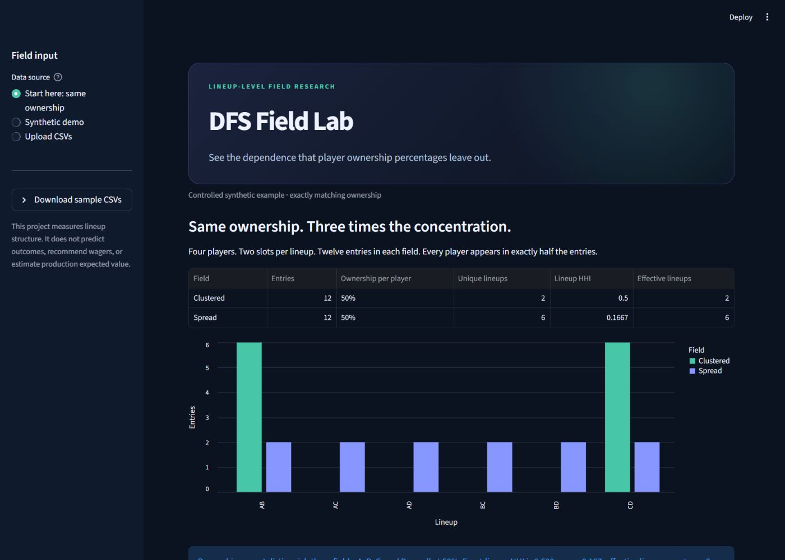

# DFS Field Model



**Same player ownership, different joint exposure.** Start with a four-player
case where every player has exactly 50% ownership, but lineup concentration
differs by a factor of three. Then explore legal eight-player lineups, an
ownership null, and CSV ingestion.

[Download the latest release](https://github.com/Jones-Nick-93/dfs-field-model/releases/latest)
· [Five-minute interview walkthrough](docs/interview-guide.md)
· [CI results](https://github.com/Jones-Nick-93/dfs-field-model/actions)

A research-oriented Python package for modeling a contest field as a
distribution over complete lineups—not merely a vector of player ownership
percentages.

The repository includes a working Streamlit dashboard with a zero-setup
synthetic demo and validated CSV upload paths.

The project focuses on a practical modeling gap: two fields can have nearly
identical marginal ownership while producing very different duplication,
stacking, and payout dynamics. The package provides validated lineup
generation, observed-contest diagnostics, transparent null models, and
calibration utilities for studying that difference.

All examples and tests use synthetic data. No customer, account, contest, or
proprietary projection data are included.

## Highlights

- Stable player-ID representation independent of DataFrame row indices
- Constraint-safe lineup optimization with SciPy/HiGHS MILP
- Fast near-optimal menu search using one MILP plus legal swap exploration
- Explicit behavioral generators with reproducible random seeds
- Wide, long, and DraftKings-style contest-export adapters
- Exact duplication, HHI, effective-lineup, overlap, salary, and stack metrics
- Player-pair co-ownership and independence diagnostics
- Ownership-weighted legal null fields with reported marginal error
- Constrained mixture-weight fitting with rank and conditioning checks
- Menu-coverage-first calibration for shared-consensus behavior
- Tested command-line report generation
- Interactive field overview, ownership, pair-structure, and lineup-inspector views

## Why lineup-level modeling?

Marginal ownership discards dependence. If a group of entrants repeatedly uses
the same core construction, a player at 20% ownership inside that cluster is a
different risk from a player at 20% ownership spread across unrelated lineups.

This package keeps both levels visible:

```text
player marginals  -> ownership level and source decomposition
complete lineups  -> duplication, overlap, stacks, and joint exposure
outcome model     -> ranks, ties, payouts, and expected value (future layer)
```

The current release implements the first two layers. It intentionally does not
claim production expected-value estimates without a sport-specific correlated
outcome model and held-out contest validation.

The included generator defaults are deliberately synthetic demonstration
values. They are not calibrated recommendations and do not encode a private
contest-selection, ownership-projection, lineup-selection, or staking process.

## Quick start

Install [uv](https://docs.astral.sh/uv/getting-started/installation/) first.
The setup commands create Python 3.12's environment from `uv.lock`.
Download and extract the release ZIP (or clone this repository), then open
a terminal in the folder containing `dev.cmd`.

On Windows:

```powershell
.\dev.cmd setup
.\dev.cmd app
```

On macOS or Linux:

```bash
sh scripts/dev.sh setup
sh scripts/dev.sh app
```

Run `.\dev.cmd check` (Windows) or `sh scripts/dev.sh check` (Linux/macOS)
to verify diff hygiene, Ruff, pytest, and the deterministic demo. A check writes
an ignored receipt to `.artifacts/verification/latest.json`. Git checks are
skipped for release ZIPs, which have no Git metadata; code checks still run.

The dashboard opens in **Start here: same ownership**. No API credentials or
contest data are needed. Choose **Synthetic demo** for the richer roster example,
or **Upload CSVs** for your own input. Download the sample pool and wide contest
CSVs in the sidebar to exercise upload mode with public-safe data.

## Dashboard

The interface provides:

- an executive field summary with exact duplication and concentration;
- observed-versus-null salary and lineup-structure comparisons;
- player ownership with realized baseline error;
- player-pair excess co-ownership and lift;
- stack and roster-shape distributions; and
- an entry-level lineup inspector.

Download an analysis ZIP with metrics, roster rules, assumptions, baseline error,
and aggregate CSV tables. Reports omit account metadata and entry rosters;
player labels and aggregates should still be reviewed before sharing.

Every page distinguishes measured facts from behavioral hypotheses. The UI
does not claim to identify user skill, explain causality, forecast outcomes, or
estimate production expected value.

## Analyze a contest export

The CLI validates every lineup before producing diagnostics:

```bash
dfs-field-report \
  --pool data/player_pool.csv \
  --entries data/contest.csv \
  --format wide \
  --entry-id-column entry_id \
  --metadata account_id=username \
  --metadata score=points \
  --roster-size 8 \
  --salary-cap 50000 \
  --position-min GK=1,D=2,M=2,F=2 \
  --flex-positions D,M,F \
  --max-per-team 4 \
  --with-null
```

The command writes JSON and CSV artifacts for:

- field-level concentration and salary summaries;
- exact duplication and stack distributions;
- player ownership and player-pair co-ownership;
- an optional ownership-weighted legal null field; and
- observed-versus-null calibration errors.

See [contest ingestion](docs/contest_ingestion.md) for supported schemas.

## Design principles

1. **Fail loudly on corrupt input.** Unknown IDs, ambiguous player names,
   illegal rosters, and inconsistent metadata are rejected.
2. **Separate assumptions from evidence.** Synthetic segment generators are
   hypotheses until fitted against observed lineups.
3. **Report null-model error.** A baseline that misses marginal ownership is not
   allowed to masquerade as evidence of joint structure.
4. **Expose identification problems.** Mixture fitting reports design rank and
   condition number alongside residual error.
5. **Prefer reproducible diagnostics to opaque scores.** Seeds, intermediate
   tables, and CLI outputs are inspectable.

## Repository layout

```text
field_model/
  core.py          Roster rules, optimization, generators, and metrics
  contest.py       Canonical contest representation and input adapters
  diagnostics.py   Observed-field reports and baseline comparisons
  baselines.py     Ownership-weighted legal null model
  calibration.py   Mixture and menu-choice calibration
  dashboard.py     Framework-independent presentation transforms
tests/              Unit and end-to-end CLI tests
docs/               Architecture, ingestion, and research roadmap
app.py              Interactive Streamlit dashboard
analyze_field.py    Report-generation CLI
demo_field.py       Reproducible synthetic walkthrough
```

## Project status

This is an extensible research package, not a wagering product. The most
important next milestone is chronological validation on legally obtained,
lineup-level contest exports. See the [research roadmap](docs/modeling_roadmap.md)
and [architecture notes](docs/architecture.md).
Dashboard behavior and privacy boundaries are documented in
[dashboard usage](docs/dashboard.md).

## Public-release boundaries

This repository contains reusable modeling infrastructure and deterministic
synthetic examples. It excludes real contest exports, account identifiers,
paid projections, private lineups, validated production parameters, selection
rules, and wagering or bankroll logic. See the full
[publication scope](docs/publication-scope.md).

For interview-oriented evidence and an honest limitations summary, see the
[portfolio notes](docs/portfolio.md).

## License

Released under the [MIT License](LICENSE).

Platform names are used only to identify compatible export formats. See
[NOTICE](NOTICE) for the non-affiliation and data-sanitization statement.
