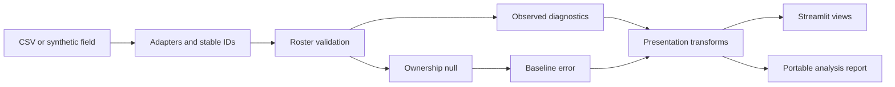

# Five-minute interview walkthrough

## Two-minute explanation

The problem: player ownership tells us how often each player appears, but discards
which players are selected together. That loses information about duplication
and joint exposure.

The design: a Python analysis package validates complete lineups using stable
player IDs, computes ownership and joint diagnostics, and exposes the results
through both a CLI and a thin Streamlit client. Synthetic fixtures make the
public demo reproducible without proprietary feeds or account data.

The evidence: the opening example fixes every player's ownership at 50% while
varying lineup HHI from 0.167 to 0.500. The larger fixture illustrates legal
roster constraints and reports the error of an approximate ownership null.
The checked-in tests verify legality, deterministic generation, CSV ingestion,
the controlled example, report contents, and UI navigation.

The limitation: this measures structure. It does not validate user intent,
forecast outcomes, or estimate profit. Those require legal real-world data,
chronological validation, and a correlated outcome/payout model.

## Demo script

1. **0:00–1:00 — Start here.** Show the matching 50% ownership column and the
   threefold HHI gap. Ask: could ownership percentages distinguish these fields?
2. **1:00–2:00 — Explain the calculation.** Expand the HHI formula. Show that
   AB appears in 6/12 versus 2/12 entries. Effective lineups are 2 versus 6.
3. **2:00–3:00 — Synthetic demo.** Show the actual roster rules, duplication,
   salary, and null error. State explicitly that imperfect marginal matching
   prevents attributing the entire null gap to dependence.
4. **3:00–4:00 — Inspect a lineup.** Check its salary, positions, and duplicate
   count. Explain why input validation happens before analytics.
5. **4:00–5:00 — Reproduce it.** Download the sample CSVs and report. Show
   `dev.cmd check`, the tests, and the architecture below.

## Architecture

## Questions worth preparing for

- **Why complete lineups?** Marginals do not determine joint selections; the
  controlled example proves it without estimation error.
- **Why stable IDs?** Row order and player display names are unreliable keys.
  Names can collide, and sorting a DataFrame must not change player identity.
- **Why a legal null?** Independent selections can violate roster rules. The
  sampler obeys constraints, but its realized marginals must be measured.
- **Why Streamlit?** It provides a small Python UI while keeping analytical
  code reusable and separately testable. Its rerun model makes caching a fixed
  synthetic analysis valuable; user uploads are not cached globally.
- **What fails at scale?** Pair tables can approach quadratic size in the pool;
  large fields and null sampling cost time and memory. Benchmark before
  setting production limits. No scalability target is currently validated.
- **What would you do next?** Obtain legally usable lineup exports, split by
  chronological slate, measure baseline calibration on held-out slates, and
  establish resource budgets and failure handling before deployment.

## Ownership and AI assistance

This project was developed with AI coding assistance. In an interview, identify
the problem framing, requirements, decisions, code, and validation you personally
understand and contributed to. Do not claim sole authorship of assisted work.
Before presenting, explain one adapter, one validation failure, the HHI formula,
and the null-model limitation without reading generated prose.

## Failure demonstration

Use the downloaded wide CSVs, change one player ID to an unknown value, and
analyze them. Validation should reject the input rather than produce misleading
metrics. Restore the sample before the interview. Public demos use synthetic
files only.
